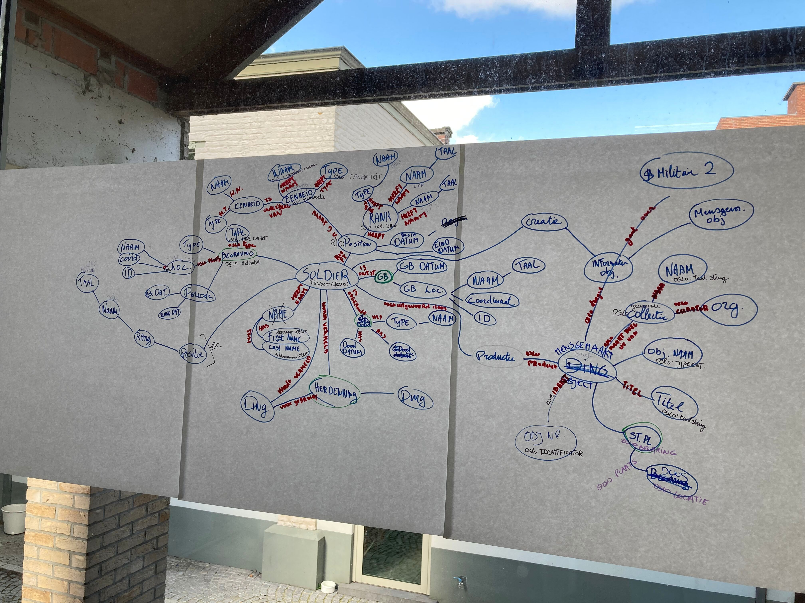

# Graaf

**Workshop tekening**


<figure><figcaption><p>Mapping MMP1917 tijdens workshop</p></figcaption></figure>

### **Naam**

<table><thead><tr><th>Veld</th><th width="177">Voorbeeld</th><th>MMP1917 pattern</th><th>OSLO pattern</th></tr></thead><tbody><tr><td>firstName</td><td>Leonard Edward</td><td>(Persoon)-[heeftNaam]-(Naam)-[heeftVoornaam]-(Voornaam)</td><td>(oslo:Persoon)-[oslo:voornaam]-(oslo:String)</td></tr><tr><td>lastName</td><td>Stump</td><td>(Persoon)-[heeftNaam]-(Naam)-[heeftAchternaam]-(Achternaam)</td><td>(oslo:Persoon)-[oslo:achternaam]-(oslo:String)</td></tr></tbody></table>

**JSON-LD sample**

```
{
  "@type": "Persoon",
  "voornaam": {
  "@type": "String",
  "@value": "Leonard Edward"
  },
  "achtenaam": {
    "@type": "String",
    "@value": "Stump"
  } 
 }
```

**Dienstnummer**

<table><thead><tr><th>Veld</th><th width="177">Voorbeeld</th><th>MMP1917 pattern</th><th>OSLO pattern</th></tr></thead><tbody><tr><td>serviceNumber</td><td>80141</td><td>(Persoon)-[heeftID]-(GeheelGetal)</td><td>(oslo:Persoon)-[cidoc:P48 has preferred identifier]-(cidoc:E42 Identifier)</td></tr></tbody></table>

**JSON-LD sample**

```
{
  "@type": "Persoon",
    "heeft voorkeurs identificatie": {
      "@type": "Identificatie",
      "@value": "854254",
      "heeft type": {
        "@type": "Concept",
        "heeft naam":
         {
          "@type": "String",
          "@value": "Stamnummer",
          "@language": "nl"
        }
     }
  }
}
```

### Rang

<table><thead><tr><th>Veld</th><th width="177">Voorbeeld</th><th>MMP1917 pattern</th><th>OSLO pattern</th></tr></thead><tbody><tr><td>rank</td><td></td><td>(Persoon)-[heeftPositie]-(Position)-[heeftRang]-(Rang)-[heeftType]-(Type)-[heeftNaam]-(Naam)-[heeftTaal]-(Taal)</td><td>(oslo:Persoon)-[RiC-R054:occupies or occupied]-(RiC:position)-[cidoc:P2 has type (is type of)]-(cidoc:E55 Type)-[cidoc:P1 is identified by (identifies)]-(cidoc:E41 Appellation)</td></tr><tr><td></td><td>Private</td><td>(Persoon)-[heeftPositie]-(Position)-[heeftRang]-(Rang)-[heeftNaam]-(Naam)-[heeftTaal]-(Taal)</td><td>(oslo:Persoon)-[RiC-R054:occupies or occupied]-(RiC:position)-[cidoc:P1 is identified by (identifies)]-(cidoc:E41 Appellation)</td></tr></tbody></table>

**JSON-LD sample**

```
{
  "@type": "Persoon",
  "bezet": {
    "@type": "Positie",
    "heeft type":
      {
        "@type": "String",
        "@value": "Rang",
        "@language": "nl"
      },
    "is geïdentificeerd door": 
      {
        "@type": "String",
        "@value": "Private",
        "@language": "nl"
     }
  }
}  
```

### Eenheid

<table><thead><tr><th>Veld</th><th width="177">Voorbeeld</th><th>MMP1917 pattern</th><th>OSLO pattern</th></tr></thead><tbody><tr><td>unit</td><td></td><td>(Persoon)-[heeftPositie]-(Position)-[heeftEenheid]-(Eenheid)-[heeftType]-(Type)-[heeftNaam]-(Naam)-[heeftTaal]-(Taal)</td><td>(oslo:Persoon)-[RiC-R054:occupies or occupied]-(RiC:position)-[RiC-E12:exists or existed in]-(RiC-E09:Group)-[cidoc:P2 has type]-(cidoc:E55 Type)-[cidoc:P1 is identified by]-(cidoc:E41 Appellation)</td></tr><tr><td></td><td>Canadian Infantry, 31st Bn. (Alberta)</td><td>(Persoon)-[heeftPositie]-(Position)-[heeftEenheid]-(Eenheid)-[heeftNaam]-(Naam)-[heeftTaal]-(Taal)</td><td>(oslo:Persoon)-[RiC-R054:occupies or occupied]-(RiC:position)-[RiC-E12:exists or existed in]-(RiC-E09:Group)-[cidoc:P1 is identified by]-(cidoc:E41 Appellation)</td></tr><tr><td></td><td></td><td></td><td></td></tr></tbody></table>

**JSON-LD sample**

```
{
  "@type": "Persoon",
  "bezet": {
    "@type": "Positie",
    "bestaat in": {
      "@type": "Organisatie",
      "heeft type": {
        "@type": "Concept",
        "heeft naam": {
          "@type": "String",
          "@value": "Canadian Infantry, 31st Bn. (Alberta)",
          "@language": "en"
        }
      }
    }
  }
}
```

### Geboorte

<table><thead><tr><th>Veld</th><th width="177">Voorbeeld</th><th>MMP1917 pattern</th><th>OSLO pattern</th></tr></thead><tbody><tr><td>dateOfBirth</td><td>9-11-1890</td><td>(Persoon)-[heeftGeboorte]-(Geboorte)-[heeftDatum]-(Datum)</td><td>(oslo:Persoon)-[cidoc:P98 was born]-(cidoc:E67:Birth)-[cidoc:P4:has time-span]-(cidoc:E52:Time-Span)</td></tr><tr><td>yearOfBirth</td><td>1890</td><td></td><td></td></tr><tr><td>placeOfBirth</td><td>Bayswater, Middlesex, Engeland, Verenigd Koninkrijk</td><td>(Persoon)-[heeftGeboorte]-(Geboorte)-[heeftLocatie]-(Locatie)-[heeftNaam]-(Naam)-[heeftTaal]-(Taal)</td><td>(oslo:Persoon)-[cidoc:P98 was born]-(cidoc:E67:Birth)-[cidoc:P7:took place at]-(cidoc:E53:Place)-[cidoc:P1:is identified by]-(cidoc:E41:Appellation)</td></tr><tr><td>placeOfBirthLat</td><td>51.51116</td><td>(Persoon)-[heeftGeboorte]-(Geboorte)-[heeftLocatie]-(Locatie)-[heeftCoördinaat]-(Coördinaat)-[heeftLengtegraad]-(Lengtegraad)</td><td>(oslo:Persoon)-[cidoc:P98 was born]-(cidoc:E67:Birth)-[cidoc:P7:took place at]-(cidoc:E53:Place)-[cidoc:P168 place is defined by]-(cidoc:E94:Space Primitive)</td></tr><tr><td>placeOfBirthLon</td><td>-0.18426</td><td>(Persoon)-[heeftGeboorte]-(Geboorte)-[heeftLocatie]-(Locatie)-[heeftCoördinaat]-(Coördinaat)-[heeftBreedtegraad]-(Breedtegraad)</td><td>(oslo:Persoon)-[cidoc:P98 was born]-(cidoc:E67:Birth)-[cidoc:P7:took place at]-(cidoc:E53:Place)-[cidoc:P168 place is defined by]-(cidoc:E94:Space Primitive)</td></tr></tbody></table>

**JSON-LD sample**

```
{
  "@type": "Persoon",
  "werd geboren": {
    "@type": "Geboorte",
    "had tijdsspanne": {
      "heeft naam": {
        "@type": "String",
        "@value": "geboortedatum",
        "@language": "nl"
      },
      "heeft begindatum": {
        "@type": "String",
        "@value": "9-11-1890"
      },
      "heeft einddatum": {
        "@type": "String",
        "@value": "9-11-1890"
      }
    }
  },
  "was aanwezig bij": {
    "@type": "Geboorte",
    "vond plaats op": {
      "@type": "Plaats",
      "op een plaats binnen": {
        "@type": "Space Primitive",
        "@value": "51.51116,-0.18426"
      },
      "heeft type": {
        "@type": "Concept",
        "heeft naam": {
          "@type": "String",
          "@value": "Bayswater, Middlesex, Engeland, Verenigd Koninkrijk",
          "@language": "en"
        }
      }
    }
  }
}
```

### Sterfte

<table><thead><tr><th>Veld</th><th width="177">Voorbeeld</th><th>MMP1917 pattern</th><th>OSLO pattern</th></tr></thead><tbody><tr><td>dateOfDeath</td><td>6-11-1917</td><td>(Persoon)-[sterft]-(Sterfte)-[heeftDatum]-(Datum)</td><td>(oslo:Persoon)-[cidoc:P100:died in]-(cidoc:E69:Death)-[cidoc:P4:has time-span (is time-span of)]-(cidoc:E52:Time-Span)</td></tr><tr><td>causeOfDeath</td><td>Killed in action (K.I.A.)</td><td>(Persoon)-[sterft]-(Sterfte)-[heeftType]-(Type)-[heeftNaam]-(Naam)-[heeftTaal]-(Taal)</td><td>(oslo:Persoon)-[cidoc:P100:died in]-(cidoc:E69:Death)-[cidoc:P2 has type]-(cidoc:E55 Type)-[cidoc:P1 is identified by]-(cidoc:E41 Appellation)</td></tr><tr><td>exactCoordinateOfDeath</td><td>28.D.6.b.90.60</td><td>(Persoon)-[heeftSterfte]-(Sterfte)-[heeftPlaats]-(Plaats)-[heeftID]-(ID)</td><td>(oslo:Persoon)-[cidoc:P100:was death of (died in)]-(cidoc:E69:Death)-[cidoc:P7:took place at]-(cidoc:E53:Place)-[cidoc:P48 has preferred identifier]-(cidoc-E42 Identifier)</td></tr><tr><td>exactCoordinateOfDeathLat</td><td>5.089.979</td><td>(Persoon)-[heeftSterfte]-(Sterfte)-[heeftPlaats]-(Plaats)-[heeftCoördinaat]-(Coördinaat)-[heeftLengtegraad]-(Lengtegraad)</td><td>(oslo:Persoon)-[cidoc:P100:died in]-(cidoc:E69:Death)-[cidoc:P7:took place at]-(cidoc:E53:Place)-[cidoc:P168 place is defined by]-(cidoc:E94:Space Primitive)</td></tr><tr><td>exactCoordinateOfDeathLon</td><td>302.133</td><td>(Persoon)-[heeftSterfte]-(Sterfte)-[heeftPlaats]-(Plaats)-[isOnderdeelVan]-(Plaats)-[heeftCoördinaat]-(Coördinaat)-[heeftBreedtegraad]-(Breedtegraad)</td><td>(oslo:Persoon)-[cidoc:P100:died in]-(cidoc:E69:Death)-[cidoc:P7:took place at]-(cidoc:E53:Place)-[cidoc:P168 place is defined by]-(cidoc:E94:Space Primitive)</td></tr><tr><td></td><td></td><td></td><td></td></tr><tr><td></td><td></td><td></td><td></td></tr></tbody></table>

**JSON-LD sample**

```
{
  "@type": "Persoon",
  "stierf in": {
    "@type": "Overlijden",
      "had tijdsspanne": {
        "heeft naam": {
        "@type": "String",
        "@value": "sterfdatum",
        "@language": "nl"
      },
      "heeft begindatum": {
        "@type": "String",
        "@value": "6/11/1917"
      },
      "heeft einddatum": {
        "@type": "String",
        "@value": "6/11/1917"
      }
    }
    "heeft type": {
      "@type": "Concept",
      "heeft naam": {
        "@type": "String",
        "@value": "Killed in Action (K.I.A.)",
        "@language": "en"
      }
    }
   "wordt geïdentificeerd door": {
      "@type": "Concept",
      "heeft naam": {
        "@type": "String",
        "@value": "coordinate of death"
        "@language": "en"
      },
        "wordt geïdentificeerd door": {
          "@type": "String",
          "@value": "28.D.6.b.90.60"
        }
      }
     "heeft type": {
      "@type": "Plaats",
      "op een plaats binnen": {
        "@type": "Space Primitive",
        "@value": "51.51116,-0.18426"
      }
    }
  }
}
```

### Bio

<table><thead><tr><th>Veld</th><th width="177">Voorbeeld</th><th>MMP1917 pattern</th><th>OSLO pattern</th></tr></thead><tbody><tr><td>age</td><td>26</td><td></td><td></td></tr><tr><td>dateOfEnlistment</td><td>18-2-1915</td><td>(Persoon)-[namDeelAan]-(Evenement)-[heeftDatum]-(Datum)</td><td>(oslo: Persoon)-[RiC-R058i: is or was participant in]-(cidoc:E14 Event)-[RiC-R068i is associated with date]-(RiC-E19 Single Date)</td></tr><tr><td>placeOfEnlistment</td><td>Calgary, Alberta</td><td>(Persoon)-[namDeelAan]-(Evenement)-[vondPlaatsOp]-(Plaats)</td><td>(oslo: Persoon)-[RiC-R058i: is or was participant in]-(cidoc:E14 Event)-[cidoc:P7 took place at]-(E53 Place)-[cidoc:P1 is identified by]-(cidoc:E41 Appellation)</td></tr><tr><td>placeOfEnlistmentLat</td><td>5.105.011</td><td>(Persoon)-[namDeelAan]-(Evenement)-[vondPlaatsOp]-(Plaats)-[heeftCoördinaat]-(Coördinaat)-[heeftLengtegraad]-(Lengtegraad)</td><td>(oslo: Persoon)-[RiC-R058i: is or was participant in]-(cidoc:E14 Event)-[cidoc:P7 took place at]-(E53 Place)-[cidoc:P171:at some place within]-(cidoc:E94:Space Primitive)</td></tr><tr><td>placeOfEnlistmentLon</td><td>-11.408.529</td><td>(Persoon)-[namDeelAan]-(Evenement)-[vondPlaatsOp]-(Plaats)-[heeftCoördinaat]-(Coördinaat)-[heeftBreedtegraad]-(Breedtegraad)</td><td>(oslo: Persoon)-[RiC-R058i: is or was participant in]-(cidoc:E14 Event)-[cidoc:P7 took place at]-(E53 Place)-[cidoc:P171:at some place within]-(cidoc:E94:Space Primitive)</td></tr><tr><td>country</td><td>Canada</td><td>(Persoon)-[namDeelAan]-(Evenement)-[vondPlaatsOp]-(Plaats)-[ValtOnder]-(Plaats)</td><td>(oslo: Persoon)-[RiC-R058i: is or was participant in]-(cidoc:E14 Event)-[cidoc:P7 took place at]-(E53 Place)-[P89 falls within]-(E53 Place)-[cidoc:P1 is identified by]-(cidoc:E41 Appellation)</td></tr><tr><td>lastKnownResidence</td><td>811 Wakehurst St. Flin Flon, MB R8A 9K6</td><td>(Persoon)-[heeftVerblijfplaats]-(Verblijfplaats)-[heeftAdres]-(Adres)</td><td>(oslo: Persoon)-[cidoc:P74 has current or former residence]-(cidoc:E53 Place)-[cidoc:P1 is identified by]-(cidoc:E41 Appellation)</td></tr><tr><td>lastKnownResidenceLat</td><td>5.105.011</td><td>(Persoon)-[heeftVerblijfplaats]-(Verblijfplaats)-[heeftVerbandMet]-(Plaats)-[heeftCoördinaat]-(Coördinaat)</td><td>(oslo: Persoon)-[cidoc:P74 has current or former residence]-(cidoc:E53 Place)-[cidoc:P48 has preferred identifier]-(cidoc-E42 Identifier)</td></tr><tr><td>lastKnownResidenceLon</td><td>-11.408.529</td><td>(Persoon)-[heeftVerblijfplaats]-(Verblijfplaats)-[heeftVerbandMet]-(Plaats)-[heeftCoördinaat]-(Coördinaat)</td><td>(oslo: Persoon)-[cidoc:P74 has current or former residence]-(cidoc:E53 Place)-[cidoc:P48 has preferred identifier]-(cidoc-E42 Identifier)</td></tr><tr><td>profession</td><td>Hotel clerk</td><td>(Persoon)-[heeftBeroep]-(Beroep)-[heeftNaam]-(Naam)</td><td>(oslo: Persoon)-[schema:heeftBeroep]-(schema:Beroep)-[cidoc:P1 is identified by (identifies)]-(cidoc:E41 Appellation)</td></tr><tr><td>religion</td><td>Church of England</td><td>(Persoon)-[heeftReligie]-(Religie)-[heeftNaam]-(Naam)</td><td>/</td></tr></tbody></table>

### JSON-LD sample

```
{
  "@type": "Persoon",
  "is of was deelnemer in": {
    "@type": "Evenement",
    "vond plaats te (getuige)": {
      "@type": "Plaats",
      "valt onder": {
        "@type": "Plaats",
        "heeft naam": {
          "@type": "String",
          "@value": "Canada",
          "@language": "nl"
        }
      }
    }
  },
  "vond plaats te (getuige)": {
    "@type": "Plaats",
    "heeft naam": {
      "@type": "String",
      "@value": "Calgary, Alberta",
      "@language": "nl"
    }
  },
  "heeft huidige of voormalige woonplaats": {
    "@type": "Persoon",
    "heeft naam": {
      "@type": "String",
      "@value": "811 Wakehurst St. Flin Flon, MB R8A 9K6",
      "@language": "nl"
    },
    "op een plaats binnen": {
      "@type": "Space Primitive",
      "@value": "5.105.011, -11.408.529"
    },
    "heeft huidige of voormalige woonplaats": {
      "@type": "Plaats",
      "op een plaats binnen": {
        "@type": "Space Primitive",
        "@value": "5.105.011, -11.408.529"
      }
    }
  }
}
```

### Herdenking

<table><thead><tr><th>Veld</th><th width="177">Voorbeeld</th><th>MMP1917 pattern</th><th>OSLO pattern</th></tr></thead><tbody><tr><td>memorial</td><td>(type)</td><td>(Persoon)-[wordtHerdachtIn]-(Herdenking)-[heeftVeruiterlijkingIn]-(Object)-[heeftType]-(Type)</td><td>(oslo:Persoon)-[cidoc:P129 is subject of]-(cidoc:E5 Event)-[cidoc:P20 had specific purpose]-(cidoc:E65 Creation)-[cidoc:P94 has created]-(cidoc:E28 Conceptual Object)-[cidoc:P108 has produced (was produced by)]-(cidoc:E22 Human-Made Object)-[cidoc:P2 has type]-(cidoc:E55 Type)</td></tr><tr><td>(naam)</td><td>Ypres (Menin Gate) Memorial</td><td>(Persoon)-[wordtHerdachtIn]-(Herdenking)-[heeftVeruiterlijkingIn]-(Object)-[heeftNaam]-(Naam)</td><td>(oslo:Persoon)-[cidoc:P129 is subject of]-(cidoc:E5 Event)-[cidoc:P20 had specific purpose]-(cidoc:E65 Creation)-[cidoc:P94 has created]-(cidoc:E28 Conceptual Object)-[cidoc:P108 has produced (was produced by)]-(cidoc:E22 Human-Made Object)-[cidoc:P1 is identified by (identifies)]-(cidoc:E41 Appellation)</td></tr><tr><td>panel</td><td>(type)</td><td>(Persoon)-[wordtHerdachtIn]-(Herdenking)-[heeftVeruiterlijkingIn]-(Object)-[isOnderdeelVan]-(Object)-[heeftType]-(Type)</td><td>(oslo:Persoon)-[cidoc:P129 is subject of]-(cidoc:E5 Event)-[cidoc:P20 had specific purpose]-(cidoc:E65 Creation)-[cidoc:P94 has created]-(cidoc:E28 Conceptual Object)-[cidoc:P108 has produced (was produced by)]-(cidoc:E22 Human-Made Object)-[P46 is composed of]-(E22 Human-Made Object)-[cidoc:P2 has type]-(cidoc:E55 Type)</td></tr></tbody></table>

**JSON-LD sample**

```
{
  "@type": "Persoon",
  "was onderwerp van": {
    "@type": "Evenement",
    "had een specifiek doel": {
      "@type": "Creatie",
      "heeft gecreëerd": {
        "@type": "Conceptueel object",
        "heeft geproduceerd": {
          "@type": "Mensgemaakt object",
          "is onderdeel van": {
            "@type": "Mensgemaakt object",
            "heeft type": {
              "@type": "String",
              "@value": "Memorial",
              "@language": "en"
            },
            "heeft naam": {
              "@type": "String",
              "@value": "Ypres (Menin Gate) Memorial",
              "@language": "en"
            }
          },
          "heeft naam": {
            "@type": "Concept",
            "heeft naam": {
              "@type": "String",
              "@value": "16B"
            }
          }
        }
      }
    }
  }
}
```

### Begraving


<table><thead><tr><th width="120">Veld</th><th width="164">Voorbeeld</th><th>MMP197 pattern</th><th>OSLO pattern</th></tr></thead><tbody><tr><td>cemetery</td><td>(type)</td><td>(Persoon)-[wordtHerdachtIn]-(Evenement)-[heeftVerbandMet]-(Plaats)-[valtOnder]-(Plaats)-[heeftType]-(Type)</td><td>(oslo:Persoon)-[cidoc:P12 was present at]-(cidoc:E5 Event)-[cidoc:P7 took place at]-(cidoc:E53 Place)-[cidoc:P89 falls within]-(cidoc:E53 Place)-[cidoc:P2 has type]-(cidoc:E55 Type)</td></tr><tr><td>(naam)</td><td>Tyne Cot Cemetery</td><td>(Persoon)-[wordtHerdachtIn]-(Evenement)-[heeftVerbandMet]-(Plaats)-[valtOnder]-(Plaats)-[heeftNaam]-(Naam)</td><td>(oslo:Persoon)-[cidoc:P12 was present at]-(cidoc:E5 Event)-[cidoc:P7 took place at]-(cidoc:E53 Place)-[cidoc:P89 falls within]-(cidoc:E53 Place)-[cidoc:P1 is identified by]-(cidoc:E41 Appellation)</td></tr><tr><td>plot</td><td>(type)</td><td>(Persoon)-[wordtHerdachtIn]-(Evenement)-[heeftVerbandMet]-(Plaats)-[heeftNaam]-(Naam)-[bestaatUit]-(Identificator)-[heeftType]-(Type)</td><td>(oslo:Persoon)-[cidoc:P12 was present at]-(cidoc:E5 Event)-[cidoc:P7 took place at]-(cidoc:E53 Place)-[cidoc:P1 is identified by]-(E41 Appellation)-[P106 is composed of]-(E42 Identifier)-[cidoc:P1 is identified by]-(cidoc:E41 Appellation)</td></tr><tr><td>(naam)</td><td>XIII</td><td>(Persoon)-[wordtHerdachtIn]-(Evenement)-[heeftVerbandMet]-(Plaats)-[heeftNaam]-(Naam)-[bestaatUit]-(Identificator)-[heeftType]-(Type)</td><td>(oslo:Persoon)-[cidoc:P12 was present at]-(cidoc:E5 Event)-[cidoc:P7 took place at]-(cidoc:E53 Place)-[cidoc:P1 is identified by]-(E41 Appellation)-[P106 is composed of]-(E42 Identifier)-[P2 has type]-(E55 Type)</td></tr><tr><td>row</td><td>(type)</td><td>(Persoon)-[wordtHerdachtIn]-(Evenement)-[heeftVerbandMet]-(Plaats)-[heeftNaam]-(Naam)-[bestaatUit]-(Identificator)-[heeftType]-(Type)</td><td>(oslo:Persoon)-[cidoc:P12 was present at]-(cidoc:E5 Event)-[cidoc:P7 took place at]-(cidoc:E53 Place)-[cidoc:P1 is identified by]-(E41 Appellation)-[P106 is composed of]-(E42 Identifier)-[cidoc:P1 is identified by]-(cidoc:E41 Appellation)</td></tr><tr><td>(naam)</td><td>G</td><td>(Persoon)-[wordtHerdachtIn]-(Evenement)-[heeftVerbandMet]-(Ding)-[IsOnderdeelVan]-(Ding)-[heeftNaam]-(Naam)-[heeftTaal]-(Taal)</td><td>(oslo:Persoon)-[cidoc:P129 is subject of]-(cidoc:E5 Event)-[cidoc:P12 occurred in the presence of]-(cidoc:E22 Human-Made Object)-[cidoc:P46 is composed of (forms part of)]-(cidoc:E22 Human-Made Object)-[cidoc:P1 is identified by (identifies)]-(cidoc:E41 Appellation)</td></tr><tr><td>grave</td><td>(type)</td><td>(Persoon)-[wordtHerdachtIn]-(Evenement)-[heeftVerbandMet]-(Ding)-[heeftType]-(Type)-[heeftNaam]-(Naam)-[heeftTaal]-(Taal)</td><td>(oslo:Persoon)-[cidoc:P129 is subject of]-(cidoc:E5 Event)-[cidoc:P12 occurred in the presence of]-(cidoc:E22 Human-Made Object)-[cidoc:P2 has type (is type of)]-(cidoc:E55 Type)-[cidoc:P1 is identified by (identifies)]-(cidoc:E41 Appellation)</td></tr><tr><td>(naam)</td><td>6</td><td>(Persoon)-[wordtHerdachtIn]-(Evenement)-[heeftVerbandMet]-(Ding)-[heeftNaam]-(Naam)-[heeftTaal]-(Taal)</td><td>(oslo:Persoon)-[cidoc:P129 is subject of]-(cidoc:E5 Event)-[cidoc:P12 occurred in the presence of]-(cidoc:E22 Human-Made Object)-[cidoc:P1 is identified by (identifies)]-(cidoc:E41 Appellation)</td></tr></tbody></table>

**JSON-LD sample**

```
{
  "@type": "Persoon",
  "was aanwezig bij": {
    "@type": "Evenement",
    "heeft type": "Begraving",
    "vond plaats op": {
      "@type": "Graf",
      "heeft type": {
        "@type": "Concept",
        "heeft naam": {
          "@type": "String",
          "@value": "Begraafplaats",
          "@language": "nl"
        }
      },
      "heeft naam": {
        "@type": "Concept",
        "heeft naam": {
          "@type": "String",
          "@value": "Tyne Cot Cemetery",
          "@language": "en"
        }
      },
      "wordt geïdentificeerd door": {
        "@type": "Identificatienummer",
        "is samengesteld uit": [
          {
            "@type": "Concept",
            "heeft naam": {
              "@type": "String",
              "@value": "Plot",
              "@language": "en"
            },
            "wordt geïdentificeerd door": {
              "@type": "String",
              "@value": "XXII"
            }
          },
          {
            "@type": "Concept",
            "heeft naam": {
              "@type": "String",
              "@value": "Row",
              "@language": "en"
            },
            "wordt geïdentificeerd door": {
              "@type": "String",
              "@value": "G"
            }
          },
          {
            "@type": "Concept",
            "heeft naam": {
              "@type": "String",
              "@value": "Grave",
              "@language": "en"
            },
            "wordt geïdentificeerd door": {
              "@type": "String",
              "@value": "2"
            }
          }
        ]
      }
    }
  }
}
```


