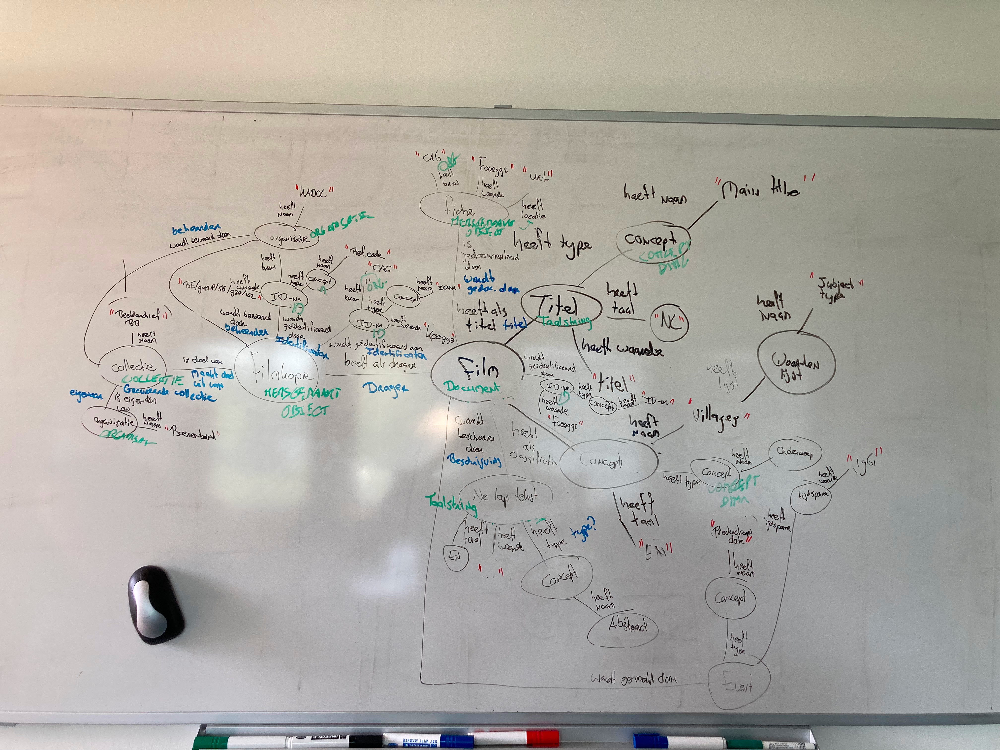

# Graaf

workshop tekening

<figure><figcaption>
workshop whiteboard
</figcaption></figure>

## Film

### Identification

| Voorbeeld                                     | CAG                                                                                                         | OSLO                                                                                                                    |
| --------------------------------------------- | ----------------------------------------------------------------------------------------------------------- | ----------------------------------------------------------------------------------------------------------------------- |
| _Type_: Objectnummer                          | (Film)-\[wordt geïdentificeerd door]-(Identificatienummer)-\[heeft type]-(Concept)-\[heeft naam]-(string)   | 
(ZelfstandigeExpressie)-[identificator]-(Identificator)-[type]-(Type Entiteit)-[skos:prefLabel]-(TaalString) 
 |
| _Waarde_ : F000001                            | (Film)-\[wordt geïdentificeerd door]-(Identificatienummer)-\[heeft waarde]-(string)                         | (ZelfstandigeExpressie)-\[identificator]-(Identificator)-\[identificator]-(GetypeerdeString)                            |
| _Bron_ : Centrum voor Agrarische Geschiedenis | (Film)-\[wordt geidentificeerd door]-(Identificatienummer)-\[toegekend door]-(Actor)-\[heeft naam]-(string) | (ZelfstandigeExpressie)-\[identificator]-(Identificator)-\[toegekend door]-(Agent)-\[naam]-(TaalString)                 |

### Title

| Voorbeeld                            | CAG                                                                             | OSLO                                                                                                 |
| ------------------------------------ | ------------------------------------------------------------------------------- | ---------------------------------------------------------------------------------------------------- |
| Waarde: "Frischer Wind In Streudorf" | {Film)-\[heeft als titel]-(titel)-\[heeft waarde]-(string)                      | (ZelfstandigeExpressie)-\[titel]-(TaalObject)-\[inhoud]-(String)                                     |
| Type: "main title"                   | {Film)-\[heeft als titel]-(titel)\[heeft type]-(Concept)-\[heeft naam]-(string) | (ZelfstandigeExpressie)-\[titel]-(TaalObject)-\[type]-(Type Entiteit)-\[skos:prefLabel]-(TaalString) |
| Taal:"de"                            | {Film)-\[heeft als titel]-(titel)-\[heeft taal]-(string)                        | (ZelfstandigeExpressie)-\[titel]-(TaalObject)-(taal)-\[Taalcode]                                     |
|                                      |                                                                                 |                                                                                                      |

### Commission

| Voorbeeld                   | CAG                                                                                         | OSLO                                                                                                                                                       |
| --------------------------- | ------------------------------------------------------------------------------------------- | ---------------------------------------------------------------------------------------------------------------------------------------------------------- |
| Type: order                 | {Film)-\[is besteld door]-(Event)-\[heeftType]-(Concept)-\[heeft naam]-(string)             | (ZelfstandigeExpressie)-\[crm:P92 was brought into existence]-(Activiteit)-\[type]-(Type Entiteit)-\[skos:prefLabel]-(TaalString)                          |
| Familienaam: Borel          | {Film)-\[is besteld door]-(Event)-\[is opdrachtgever]-(Agent)-\[heeft familienaam]-(string) | (ZelfstandigeExpressie)-\[crm:P92 was brought into existence]-(Activiteit)-\[activiteit]-(Rol)-\[agent]-(Persoon)-\[heeft achternaam]-(TaalString)         |
| Voornaam: Victor            | {Film)-\[is besteld door]-(Event)-\[is opdrachtgever]-(Agent)-\[heeft voornaam]-(string)    | (ZelfstandigeExpressie)-\[crm:P92 was brought into existence]-(Activiteit)-\[activiteit]-(Rol)-\[agent]-(Persoon)-\[heeft voornaam]-(TaalString)           |
| organisatienaam: Boerenbond | {Film)-\[is besteld door]-(Event)-\[is opdrachtgever]-(Agent)-\[heeft naam]-(string)        | (ZelfstandigeExpressie)-\[crm:P92 was brought into existence]-(Activiteit)-\[activiteit]-(Rol)-\[agent]--(Organisatie)-\[heeft voorkeursnaam]-(TaalString) |
| Rol: orderer                | {Film)-\[is besteld door]-(Event)-\[is opdrachtgever]-(Agent)-\[heeft type]-(string)        | (ZelfstandigeExpressie)-\[crm:P92 was brought into existence]-(Activiteit)-\[activiteit]-(Rol)-\[type]-(Type Entiteit)-\[skos:prefLabel]-(TaalString)      |

### Creation

| Voorbeeld             | CAG                                                                                                                                                   | OSLO                                                                                                                 |
| --------------------- | ----------------------------------------------------------------------------------------------------------------------------------------------------- | -------------------------------------------------------------------------------------------------------------------- |
| Achternaam: Nackaerts | {Film)-\[is geregiseerd door]-(Event)-\[is regisseur]-(Agent)-\[heeft familienaam]-(string)                                                           | (ZelfstandigeExpressie)-\[creatie]-(Creatie)-\[activiteit]-(Rol)-\[agent]-(Persoon)-\[heeft achternaam]-(TaalString) |
| Voornaam: Hein        | {Film)-\[is geregiseerd door]-(Event)-\[is regisseur]-(Agent)-\[heeft voornaam]-(string)                                                              | (ZelfstandigeExpressie)-\[creatie]-(Creatie)-\[activiteit]-(Rol)-\[agent]-(Persoon)-\[heeft voornaam]-(TaalString)   |
| Rol: Director         | {Film)-\[is geregiseerd door]-(Event)-\[is uitgevoerd door]-(Agent)-\[heeft rol]-(string)-\[heeft als classificatie]-(Concept)-\[heeft naam]-(String) | (ZelfstandigeExpressie)-\[creatie]-(Creatie)-\[activiteit]-(Rol)-\[rol]-(Type Rol)-\[skos:prefLabel]-(TaalString)    |

### Publication

###

### Description

### Rights

## Film Copy

### Film Copy Number

### Provenance

### Format

### Extent

### Condition

### Rights
