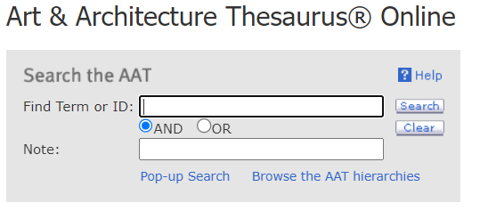

# termennetwerken

Zoals beschreven in de strategie ([link met andere databronnen](../strategie-tot-implementatie.md#3.-link-met-andere-databronnen)) is het belangrijk om bij het registreren voldoende rekening te houden voor het toekennen van URIs die verwijzen naar andere termennetwerken. Zo verrijk je niet enkel de fiches inhoudelijk, maar verzeker je ook dat de gepubliceerde data aansluiting en verbinding vindt met andere datasets.

## gebruikte termennetwerken: nationaal/regionaal

### [Inventaris onroerend erfgoed](https://inventaris.onroerenderfgoed.be)

_Deze inventaris geeft je een overzicht van het waardevolle erfgoed in Vlaanderen. Zowel archeologisch, bouwkundig, landschappelijk als varend erfgoed zijn opgenomen, goed voor meer dan 90.000 erfgoedobjecten in totaal._

wordt gebruikt voor het verwijzen naar afgebeelde gebouwen (zowel in het geval van associaties en iconografische beschrijvingen). Daarnaast kan het ook gebruikt worden voor het verwijzen naar een plaats waar het object zich bevindt tijdens een gegeven event (tentoonstelling, productie, vervaardiging, herkomst).


**correcte verwijzing:** [**https://id.erfgoed.net/themas/**](https://id.erfgoed.net/themas/2909)**{id}**\
\*\*\*\*voorbeeld: [https://id.erfgoed.net/themas/2909](https://id.erfgoed.net/themas/2909)\
\
in adlib/axiell via velden;\
bron: [https://id.erfgoed.net/themas/](https://id.erfgoed.net/themas/2909)\
nummer: {id}




```
InformatieObject.gaatOver: [
    {
        @type: "Entiteit",
        Entiteit.type: [
    {
    @id: "https://id.erfgoed.net/themas/2909",
    skos:prefLabel: {
        @value: "Kleine Vismarkt",
        @language: "nl"
        }
    },
    {
        @id: "cest:Naam_geassocieerd_concept",
        label: "associatie.onderwerp"
    }
]
```



### [databank kunstenpunt](https://data.kunsten.be)

Databank Kunstenpunt biedt een rijke lijst van personen, instellingen en locaties uit het performatieve kunsten veld.&#x20;


### fashion thesaurus (MoMU)

### thesaurus van Belgische fotografen (FoMU)

## gebruikte termennetwerken: internationaaal


### RKD Artists

_RKD Artists biedt een rijke lijst met kunstenaars (vervaardigers) uit het samengesteld door het Rijksarchief te Nederland. De focus wordt hierbij gelegd op vervaardigdigers uit de Nederlanden en is daarom ook een rijke bron voor het opzoeken van vlaamse, Belgische en Nederlandse vervaardigers._&#x20;

wordt gebruikt voor het toekennen van externe bronnen in de personen en instellingen databank (Adlib/Axiell Collections).&#x20;


**correcte verwijzing:**  [**https://rkd.nl/explore/artists/**](https://rkd.nl/explore/artists/)**{id}**

\*\*\*\*voorbeeld: https://rkd.nl/explore/artists/99242\
\
in adlib/axiell via velden;\
**bron:** [**https://rkd.nl/explore/artists/**](https://rkd.nl/explore/artists/)\
nummer: {id}





```
owl:sameAs: [
    "https://rkd.nl/explore/artists/99242",
    "VAIact-0006177"
]
```




### Getty Vocabularies

Getty Vocabularies, onderdeel van het Getty Research Institute, bevat verschillende soorten databanken. Elke databank bevat een andere thesaurus, met een focus op een ander thema zoals bijvoorbeeld kunst, architectuur of archiefmateriaal. De thesauri die binnen het project van Collectie van de Gentenaar gebruikt worden:

* **Art & Arthictecture Thesaurus** (AAT): gebruikers kunnen hier termen, definities van objecten, stijlen, materialen, ... terugvinden die gelinkt zijn aan kunst en architectuur.
* **Union List of Artists Names** (ULAN): deze databank bevat namen en biografische informatie van artiesten, architecten, bedrijven, ... die werkzaam zijn binnen de kunstwereld.
* **Getty Thesaurus of Geographic Names** (TGN): plaatsnamen, hiërarchische context van historische en archeologische sites, dorpen, landen, naties enzovoort, kunnen worden opgezocht in de databank van TGN.

Ter illustratie:






```
owl:sameAs: [
    "http://vocab.getty.edu/ulan/500277269",
    "https://www.wikidata.org/entity/Q1855386",
    "VAIact-0006085"
],
```






